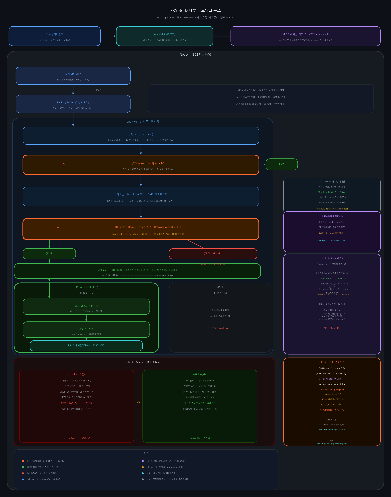

# 지식 정리 (Knowledge Note)

---

## 기본 정보

| 항목 | 내용 |
|------|------|
| **주제** | EKS VPC CNI Network Policy 처리 방식: iptables vs eBPF |
| **분류** | 인프라 / 네트워크 / 보안 |
| **키워드** | EKS, VPC CNI, eBPF, iptables, Network Policy, TC 훅, PolicyEndpoints, aws-eks-nodeagent, ENI |
| **학습 계기** | 업무 중 필요 — 운영 중인 EKS 클러스터가 iptables/eBPF 중 어느 모드로 동작하는지 파악 필요 |
| **관련 업무 ID** | - |
| **최초 작성일** | 2026-04-16 |
| **최종 수정일** | 2026-04-16 |
| **숙련도** | 🌿 이해 |

---

## 1. 한 줄 요약 (TL;DR)

```
EKS VPC CNI에서 iptables/eBPF 구분은 주로 NetworkPolicy 처리 방식을 의미한다.
기본 라우팅·SNAT은 항상 iptables 기반이며, eBPF는 VPC CNI v1.14+ / EKS 1.25+ 환경에서
aws-eks-nodeagent의 --enable-network-policy=true 플래그로 활성화된다.
eBPF가 켜지면 NetworkPolicy를 커널 TC Ingress 훅에 부착된 eBPF 프로그램이 O(1) 해시 조회로 처리한다.
```

---

## 2. 배경 지식 (Prerequisites)

- **필수 선행 지식**:
  - Kubernetes Pod / Namespace / NetworkPolicy 개념
  - Linux 네트워크 네임스페이스, veth pair
  - AWS ENI(Elastic Network Interface) 기본 개념

- **관련 개념과의 관계**:
  ```
  [EKS Cluster]
    └── [aws-node DaemonSet]
          ├── [aws-vpc-cni-init]          ← CNI 바이너리 초기화
          ├── [aws-node]                  ← ipamd: ENI/IP 풀 관리
          └── [aws-eks-nodeagent]         ← eBPF 기반 NetworkPolicy 처리 (v1.14+)
                  │
                  └─► PolicyEndpoints CRD 감시
                          │
                          └─► eBPF 바이트코드 → 커널 TC 훅에 부착
  ```

---

## 3. 개념 설명 (Concept)

### 전체 구조 다이어그램

> EKS Node 내부 패킷 흐름 — 외부 클라이언트 요청이 파드 컨테이너에 도달하기까지의 전체 과정



---

### 3.1 정의 (What)

```
EKS VPC CNI(Amazon VPC Container Network Interface)는 Kubernetes 파드에 VPC 내 실제 IP를
직접 부여하는 플러그인이다. 파드 IP가 VPC Secondary IP이므로 오버레이 없이 AWS 인프라가
파드까지 직접 라우팅할 수 있다.

eBPF(extended Berkeley Packet Filter)는 Linux 커널 내부에서 사용자 정의 프로그램을
안전하게 실행하는 기술이다. 커널 소스 수정이나 모듈 로드 없이 TC 훅 같은 커널 포인트에
코드를 부착하여 패킷을 처리할 수 있다.
```

### 3.2 존재 이유 (Why)

```
[iptables의 한계]
iptables는 규칙 목록을 위에서부터 순차 검사(O(N))한다.
Kubernetes에서 서비스·파드가 수백~수천 개로 늘어나면 규칙 수도 폭발적으로 증가하고
규칙 변경 시 전체 테이블을 잠그는 lock이 발생해 레이턴시가 급증한다.

[eBPF의 장점]
- Hash Map 조회 한 번으로 허용/차단 결정 → O(1)
- TC Ingress 훅이 L2 파싱 직후(L3 이전)에 위치 → DROP 시 L3 라우팅·conntrack·L4 파싱 모두 생략
- 규칙 변경이 원자적(atomic) → iptables처럼 테이블 전체 잠금 불필요
```

### 3.3 동작 원리 (How it works)

#### 준비 단계 (파드 생성 시 1회)

```
① Kubernetes NetworkPolicy 생성/변경
        ↓
② Network Policy Controller (aws-node 내부) 감지
        ↓
③ PolicyEndpoint CRD 오브젝트 생성
   (어떤 파드에 어떤 허용/차단 규칙을 적용할지 명세)
        ↓
④ aws-eks-nodeagent가 PolicyEndpoint를 읽음
        ↓
⑤ libbpf SDK → bpf() 시스템 콜로 eBPF 바이트코드를 커널에 로드(load)
   ├── Verifier: 무한 루프·메모리 경계·특권 연산 안전성 검증
   └── JIT 컴파일: x86_64/ARM64 네이티브 코드로 변환
        ↓
⑥ /sys/fs/bpf/globals/aws/programs/ 에 핀(pin)
   (nodeagent 재시작 시에도 커널 프로그램 유지)
        ↓
⑦ 파드 veth 인터페이스(eniX)의 TC Ingress/Egress 훅에 부착(attach)
```

#### 패킷 처리 단계 (외부 → 파드, 요청마다 반복)

```
[외부 클라이언트]  src:1.2.3.4  dst:파드IP(10.0.1.15)
      │
      ▼
[AWS NLB] (IP 모드)
  VPC 라우터: "10.0.1.15는 Node-1의 ENI에 있음" → Node-1으로 직접 라우팅
      │
      ▼
[Node-1 물리 NIC eth0]
  DMA → RX Ring Buffer(커널 메모리)에 적재
  MSI-X 하드 인터럽트 → SoftIRQ(NAPI poll) → 커널이 패킷 꺼냄
      │
      ▼
[L2 파싱] eth_type_trans()
  이더넷 헤더 파싱, dst MAC = 내 MAC 확인
  sk_buff 구조체 생성, 상위 프로토콜 타입 식별
      │
      ▼
[TC Ingress 훅 ① on eth0]  ← eBPF 부착 (노드 레벨 기본 정책)
      │ PASS
      ▼
[L3 파싱] ip_rcv()
  dst IP = 10.0.1.15
  Linux 호스트 라우팅 테이블 조회: "10.0.1.15 dev eni-A" → eni-A로 포워딩
  conntrack 신규 연결 등록
      │
      ▼
[TC Ingress 훅 ② on eni-A]  ← ★ NetworkPolicy 핵심 검사
  PolicyEndpoint Hash Map 조회: O(1)
  허용 → PASS / 차단 → DROP(이후 L4·소켓 처리 전혀 없음)
      │ PASS
      ▼
[veth pair 통과]
  eni-A(호스트 네임스페이스) ───────► eth0(파드 네임스페이스)
      │
      ▼
[파드 내부 L4 처리]
  dst Port = 8080 → 소켓 수신 버퍼에 적재
      │
      ▼
[컨테이너 애플리케이션] accept() / read() ✅
```

#### TC 훅이 두 곳(eth0, eni-A)에 존재하는 이유

```
eth0  : 노드의 모든 파드가 공유 → 노드 레벨 기본 체크만 수행
eni-A : 파드 A 전용 인터페이스 → 파드별 세밀한 NetworkPolicy 검사 위치
        (라우팅 테이블 조회 후 어느 파드로 갈지 확정된 뒤 실행되므로 파드 특정 가능)
```

### 3.4 구성 요소 / 핵심 용어 (Key Terms)

| 용어 | 설명 | 비고 |
|------|------|------|
| **VPC CNI** | 파드에 VPC Secondary IP를 직접 부여하는 CNI 플러그인 | 오버레이(VXLAN) 불필요 |
| **ipamd** | 각 노드의 ENI·IP 풀을 상시 관리하는 데몬 (aws-node 컨테이너) | DaemonSet으로 노드마다 실행 |
| **aws-eks-nodeagent** | eBPF 바이트코드 로드·관리 담당 컨테이너 (v1.14+) | --enable-network-policy=true 필요 |
| **PolicyEndpoints** | eBPF 아키텍처 전용 CRD. NetworkPolicy → nodeagent 전달 명세서 | iptables 모드에선 존재하지 않음 |
| **TC(Traffic Control)** | 네트워크 인터페이스 단위로 패킷 처리를 제어하는 Linux 서브시스템 | 원래 QoS 목적, eBPF 부착 포인트로 활용 |
| **TC Ingress/Egress 훅** | 인터페이스별 패킷 수신/송신 시 자동 실행되는 콜백 슬롯 | eBPF 프로그램을 attach 가능 |
| **BPF 파일시스템** | /sys/fs/bpf — eBPF 프로그램을 pin해 영속성 보장 | bpf-pin-path 볼륨으로 컨테이너에 마운트 |
| **RX Ring Buffer** | NIC가 DMA로 패킷을 적재하는 커널 메모리 내 원형 큐 | SoftIRQ(NAPI poll)로 커널이 처리 시작 |
| **sk_buff** | 커널 네트워크 스택에서 패킷을 표현하는 핵심 구조체 | 데이터 복사 없이 포인터 변경으로 계층 이동 |
| **veth pair** | 두 네트워크 네임스페이스를 연결하는 가상 케이블 | 한 끝: 호스트(eniX), 다른 끝: 파드(eth0) |
| **ENI Secondary IP** | EC2 인스턴스의 ENI에 추가로 부여된 IP → 파드 IP로 사용 | VPC가 이 IP를 해당 노드로 직접 라우팅 |
| **warm pool** | ipamd가 미리 확보해 두는 미사용 Secondary IP 예비 풀 | 파드 생성 레이턴시 단축 |

---

## 4. 비교 및 구분 (Comparison)

### 4.1 iptables vs eBPF 방식 비교

| 구분 | iptables (기존) | eBPF (신규) |
|------|----------------|------------|
| **적용 대상** | NetworkPolicy 처리 전체 | NetworkPolicy 처리 (기본 SNAT·라우팅은 여전히 iptables) |
| **처리 위치** | Netfilter 체인 (L3 이후) | TC Ingress 훅 (L2 직후, L3 이전) |
| **조회 복잡도** | O(N) 순차 검사 | O(1) Hash Map 조회 |
| **규칙 변경** | 전체 테이블 lock | 원자적 Map 업데이트 |
| **DROP 효율** | L3·L4 처리 후 DROP 가능 | L3 이전에 DROP → 이후 모든 처리 생략 |
| **진단 도구** | iptables -L -n | bpftool, aws-eks-na-cli, PolicyEndpoints CRD |
| **최소 요구 버전** | 모든 버전 | VPC CNI v1.14+, EKS 1.25+ |
| **활성화 방법** | 기본값 | --enable-network-policy=true |

### 4.2 VPC CNI vs Overlay CNI 비교

| 구분 | VPC CNI (EKS 기본) | Overlay CNI (Flannel·Calico VXLAN 등) |
|------|------------------|--------------------------------------|
| **파드 IP** | VPC Secondary IP (실제 IP) | 가상 IP (VPC 외부에서 모름) |
| **노드 간 통신** | VPC 라우터가 직접 처리 | VXLAN 캡슐화 → 타깃 노드에서 디캡슐화 |
| **레이턴시** | 낮음 (캡슐화 없음) | 높음 (캡슐화 오버헤드) |
| **가시성** | VPC Flow Logs에 파드 IP 직접 표시 | 노드 IP만 표시 |

### 4.3 AWS VPC 라우팅 테이블 vs Linux 호스트 라우팅 테이블

| 구분 | AWS VPC 라우팅 테이블 | Linux 호스트 라우팅 테이블 |
|------|---------------------|--------------------------|
| **존재 범위** | 서브넷 단위 | 노드(EC2) 각각 독립 |
| **관리 주체** | AWS 콘솔/API | VPC CNI(ipamd)가 자동 수정 |
| **역할** | VPC 서브넷 간 경로 정의 | 파드 IP → 해당 veth(eniX) 매핑 |
| **내용 예시** | 10.0.0.0/16 → local | 10.0.1.15 dev eni-A scope link |

---

## 5. 실전 예시 (Examples)

### 5.1 eBPF 활성화 여부 확인 (kubectl 권한만 있을 때)

#### 방법 1: aws-eks-nodeagent 실행 args 확인 (가장 확실)

```bash
kubectl get ds aws-node -n kube-system \
  -o jsonpath='{.spec.template.spec.containers[?(@.name=="aws-eks-nodeagent")].args}'

# 출력 해석
# --enable-network-policy=true  → eBPF 활성화
# --enable-network-policy=false 또는 플래그 없음 → iptables 전용
```

#### 방법 2: PolicyEndpoints CRD 존재 여부 (eBPF 전용 구조적 증거)

```bash
kubectl get crd | grep policyendpoint
# 출력: policyendpoints.networking.k8s.aws  → eBPF 아키텍처 동작 중

kubectl get policyendpoints -A
# NetworkPolicy가 없으면 빈 목록일 수 있음
```

**왜 증거인가?**
PolicyEndpoint는 VPC CNI eBPF 아키텍처에서만 존재하는 CRD다.
iptables 방식은 kube-proxy가 직접 iptables에 규칙을 기록하므로 이 중간 오브젝트 자체가 불필요하다.

#### 방법 3: bpf-pin-path 볼륨 마운트 확인 (설계 수준 증거)

```bash
kubectl get ds aws-node -n kube-system \
  -o jsonpath='{.spec.template.spec.volumes[*].name}' | tr ' ' '\n'

# bpf-pin-path 볼륨 있음 → /sys/fs/bpf를 컨테이너에 마운트 → eBPF 활성화
# 없음                   → iptables 전용
```

#### 방법 4: aws-eks-nodeagent 컨테이너 로그 확인

```bash
# aws-node 파드 이름 확인
kubectl get pod -n kube-system -l k8s-app=aws-node

# nodeagent 로그에서 eBPF 로드 기록 확인
kubectl logs -n kube-system <aws-node-파드명> \
  -c aws-eks-nodeagent | grep -i ebpf | tail -20

# eBPF 활성화 시 출력 예시:
# Successfully loaded eBPF program for pod <pod-name>
# Attached eBPF program to interface <eth0>
```

---

### 5.2 노드에 직접 접근 가능할 때 (SSH/SSM)

```bash
# eBPF 프로그램이 BPF 파일시스템에 핀되었는지 확인
ls /sys/fs/bpf/globals/aws/programs/ 2>/dev/null \
  && echo "eBPF 활성화" || echo "eBPF 비활성화 (iptables 전용)"

# VPC CNI 전용 CLI로 로드된 eBPF 프로그램 목록 확인
sudo /opt/cni/bin/aws-eks-na-cli ebpf progs
sudo /opt/cni/bin/aws-eks-na-cli ebpf loaded-ebpfdata

# bpftool로 AWS eBPF 프로그램 확인
sudo bpftool prog list | grep -i aws

# nodeagent 로그 직접 확인
sudo cat /var/log/aws-routed-eni/network-policy-agent.log | tail -30
sudo cat /var/log/aws-routed-eni/ebpf-sdk.log | tail -30

# kube-proxy 모드 확인 (eBPF와 별개 — kube-proxy 자체 모드)
kubectl describe cm -n kube-system kube-proxy-config | grep mode
```

---

### 5.3 주의해야 할 패턴 (Anti-pattern)

```bash
# ❌ aws-network-policy-agent 컨테이너 존재 여부로 판단 (v1.14 이후 부정확)
kubectl get daemonset aws-node -n kube-system \
  -o jsonpath='{.spec.template.spec.containers[*].name}'
# aws-vpc-cni-init, aws-node, aws-eks-nodeagent 3개만 있어도
# eBPF가 활성화된 것이 아닐 수 있음
```
> 문제점: v1.14+에서 aws-eks-nodeagent는 항상 존재하지만 eBPF 활성화 여부는 --enable-network-policy 플래그가 결정한다.

```bash
# ✅ 반드시 args 플래그로 판단
kubectl get ds aws-node -n kube-system \
  -o jsonpath='{.spec.template.spec.containers[?(@.name=="aws-eks-nodeagent")].args}'
```
> 이유: 컨테이너 존재 ≠ 기능 활성화. 활성화 여부는 런타임 인자(args)가 결정한다.

---

## 6. 트러블슈팅 경험 (Troubleshooting)

### 문제 1. sudo 권한 없이 eBPF 확인이 안 되는 상황

- **증상**: 노드에 SSH 접근 가능하지만 sudo 권한 없어 bpftool·aws-eks-na-cli 실행 불가
- **원인**: eBPF 프로그램 조회는 커널 레벨 권한 필요
- **해결**:
  ```bash
  # sudo 없이 kubectl로만 확인 가능한 3가지 방법 사용
  # 1. PolicyEndpoints CRD 존재 확인
  kubectl get crd | grep policyendpoint

  # 2. bpf-pin-path 볼륨 마운트 확인
  kubectl get ds aws-node -n kube-system \
    -o jsonpath='{.spec.template.spec.volumes[*].name}' | tr ' ' '\n'

  # 3. nodeagent args 확인
  kubectl get ds aws-node -n kube-system \
    -o jsonpath='{.spec.template.spec.containers[?(@.name=="aws-eks-nodeagent")].args}'
  ```
- **교훈**: kubectl 권한만으로도 CRD 존재 + 볼륨 마운트 + args 조합으로 확실히 판단 가능하다. 세 가지 모두 양성이면 eBPF가 실제 동작 중이라고 확신할 수 있다.

---

## 7. 실전 명령어 / 치트시트 (Cheat Sheet)

```bash
# ─────────────────────────────────────────────
# [모드 확인 - kubectl 권한만 있을 때]
# ─────────────────────────────────────────────

# 1. nodeagent args로 eBPF 활성화 여부 확인 (가장 확실)
kubectl get ds aws-node -n kube-system \
  -o jsonpath='{.spec.template.spec.containers[?(@.name=="aws-eks-nodeagent")].args}'

# 2. PolicyEndpoints CRD 확인 (eBPF 구조적 증거)
kubectl get crd | grep policyendpoint
kubectl get policyendpoints -A

# 3. bpf-pin-path 볼륨 마운트 확인
kubectl get ds aws-node -n kube-system \
  -o jsonpath='{.spec.template.spec.volumes[*].name}' | tr ' ' '\n'

# 4. nodeagent 컨테이너 로그에서 eBPF 로드 기록 확인
kubectl logs -n kube-system -l k8s-app=aws-node \
  -c aws-eks-nodeagent | grep -i "ebpf\|network.policy" | tail -30

# 5. VPC CNI 버전 확인
kubectl describe daemonset aws-node -n kube-system | grep Image

# ─────────────────────────────────────────────
# [모드 확인 - 노드 접근 가능할 때]
# ─────────────────────────────────────────────

# BPF 파일시스템 핀 확인
ls /sys/fs/bpf/globals/aws/programs/

# eBPF 프로그램 목록
sudo /opt/cni/bin/aws-eks-na-cli ebpf progs
sudo bpftool prog list | grep -i aws

# nodeagent 로그
sudo tail -30 /var/log/aws-routed-eni/network-policy-agent.log

# RX Ring Buffer 크기 확인 (트래픽 드랍 진단)
ethtool -g eth0

# Linux 호스트 라우팅 테이블 (파드 IP → veth 매핑 확인)
ip route | grep -E "10\.|eni"

# TC 훅 부착 현황 (인터페이스별 eBPF 프로그램 확인)
tc filter show dev eth0 ingress
tc filter show dev eni-XXXXX ingress
```

---

## 8. 깊게 이해하기 (Deep Dive)

### 8.1 eBPF 바이트코드가 커널에 로드되는 5단계

```
① C 소스코드 (빌드 타임)
   AWS 엔지니어가 작성한 C 코드를 clang -target bpf로 컴파일
   → eBPF 바이트코드(.o 파일)가 컨테이너 이미지에 번들링

② bpf() 시스템 콜 호출 (런타임)
   aws-eks-nodeagent 프로세스
       → libbpf 라이브러리
       → bpf(BPF_PROG_LOAD, bytecode, ...)  시스템 콜
       → Linux Kernel (컨테이너·호스트가 커널 공유이므로 가능)

③ Verifier 안전성 검증
   커널이 외부 코드를 무조건 신뢰하지 않음
   - 무한 루프 없음 확인
   - 메모리 경계 초과 없음 확인
   - 불허된 특권 연산 없음 확인
   검증 실패 시 로드 거부

④ JIT 컴파일
   eBPF 바이트코드 → x86_64/ARM64 네이티브 머신 코드
   인터프리터가 아닌 네이티브 속도로 실행

⑤ TC 훅 부착 + BPF 파일시스템 핀
   파드 veth(eniX)의 TC Ingress/Egress 훅에 attach
   /sys/fs/bpf/globals/aws/programs/<pod-name> 에 pin
   → nodeagent 재시작 시에도 커널 프로그램 유지
```

### 8.2 RX Ring Buffer와 패킷 수신 흐름

```
물리 케이블 → NIC 하드웨어 수신
      ↓ DMA(CPU 개입 없이 NIC가 직접 RAM에 적재)
RX Ring Buffer (커널 메모리 고정 영역)
      ↓ MSI-X 하드 인터럽트 (NIC → CPU)
IRQ Handler: napi_schedule() 호출 후 즉시 반환
      ↓ SoftIRQ 스케줄링
NAPI poll(): Ring Buffer에서 sk_buff 생성하며 패킷 꺼냄
      ↓
L2 파싱 시작

[Ring(원형) 구조의 이유]
선형 큐:   꽉 차면 Overflow → 패킷 드랍
Ring 큐:   tail이 head를 따라잡으면 오래된 것 덮어씀 → 고정 메모리 순환 재사용

[성능 주의사항]
ethtool -g eth0 으로 Ring Buffer 크기 확인
고트래픽 상황에서 드랍이 발생하면 크기 증가 권장
```

### 8.3 커널 네트워크 스택 계층별 처리

```
[L2] eth_type_trans()
  이더넷 헤더 파싱, dst MAC 확인, sk_buff 생성
      ↓
★ [TC Ingress 훅] ← eBPF 부착 지점 (L3 이전!)
      ↓ (PASS)
[L3] ip_rcv()
  IP 헤더 파싱, 라우팅 테이블 조회, conntrack 등록
      ↓
[L4] tcp_v4_rcv() / udp_rcv()
  TCP/UDP 헤더 파싱, 소켓 매핑
      ↓
[소켓 수신 버퍼]
  애플리케이션이 read() / recv()로 꺼냄

[왜 L3 이전에 TC 훅인가]
DROP 결정이 L2 직후에 내려지면 L3 라우팅 조회·conntrack 등록·L4 소켓 매핑
등 무거운 연산이 전혀 실행되지 않아 CPU 효율이 크게 향상된다.
iptables의 Netfilter는 L3 이후에 동작하므로 이미 라우팅·conntrack을
거친 후에 DROP하는 셈이다.
```

### 8.4 VPC CNI ENI 구조 (노드 단위)

```
Node-1 (EC2)
  ├── ENI-1 (Primary ENI)
  │     Primary IP:    10.0.1.5    ← 노드 자신의 IP
  │     Secondary IP:  10.0.1.15   ← 파드 A에 할당
  │     Secondary IP:  10.0.1.16   ← 파드 B에 할당
  │     Secondary IP:  10.0.1.17   ← warm pool (예비)
  │
  └── ENI-2 (슬롯 부족 시 자동 추가)
        Secondary IP:  10.0.1.18   ← 파드 C에 할당

- ipamd(aws-node 컨테이너)가 각 노드에서 독립적으로 ENI·IP 풀 관리
- 다른 노드의 파드 IP는 이 테이블에 포함되지 않음
- VPC 라우터는 "10.0.1.15 → Node-1의 ENI" 매핑을 알고 있어 직접 전달

Linux 호스트 라우팅 테이블 (ip route):
  10.0.1.15 dev eni-A scope link   ← 파드 A 생성 시 VPC CNI가 자동 추가
  10.0.1.16 dev eni-B scope link
  10.0.1.17 dev eni-C scope link
  0.0.0.0/0 via 10.0.1.1           ← 기본 게이트웨이
```

### 8.5 버전별 차이

| 버전 | 변경 내용 | 영향 |
|------|-----------|------|
| VPC CNI v1.14+ / EKS 1.25+ | aws-eks-nodeagent 컨테이너 추가, eBPF 기반 NetworkPolicy 지원 | --enable-network-policy=true로 활성화 가능 |
| VPC CNI v1.14 미만 | aws-network-policy-agent 컨테이너 (별도) | eBPF 미지원, iptables 전용 |
| NLB IP 모드 | 파드 IP로 직접 전달, DNAT 없음 | VPC CNI 환경 권장 방식 |
| NLB Instance 모드 | 노드 IP:NodePort로 전달 후 iptables DNAT | 기존 방식, SNAT 홉 추가 |

---

## 9. 나만의 요약 (My Summary)

```
EKS VPC CNI의 iptables/eBPF 구분은 "NetworkPolicy를 누가 처리하느냐"의 차이다.

eBPF가 켜지면 파드 생성 시 aws-eks-nodeagent가 NetworkPolicy 규칙을
eBPF 바이트코드로 변환해 커널 TC 훅에 심어둔다.
패킷이 들어올 때마다 L2 파싱 직후 이 훅이 Hash Map을 O(1)로 조회해
허용/차단을 결정한다. iptables의 O(N) 순차 검사와 비교하면 규모가 커질수록
차이가 극명해진다.

VPC CNI의 핵심 강점은 파드 IP = VPC Secondary IP여서
오버레이 없이 VPC 라우터가 파드까지 직접 라우팅한다는 점이다.
이 덕분에 노드 간 파드 통신도 캡슐화 없이 VPC 인프라로 처리된다.

eBPF 확인은 kubectl만으로 가능하다:
args의 --enable-network-policy=true + PolicyEndpoints CRD 존재 + bpf-pin-path 볼륨
이 세 가지가 모두 있으면 현재 eBPF가 실제로 동작 중이라고 확신할 수 있다.
```

**기억할 포인트 3가지:**
1. TC Ingress 훅은 L2 직후, L3 이전에 위치 → DROP 시 이후 모든 커널 연산 생략 = eBPF의 효율 원천
2. eBPF 활성화 여부는 컨테이너 존재가 아닌 `--enable-network-policy=true` args로 판단
3. PolicyEndpoints CRD = eBPF 아키텍처의 구조적 증거 (iptables 모드에서는 존재 자체가 없음)

**다음에 헷갈릴 것 같은 부분:**
- TC 훅이 eth0(노드 레벨)과 eniX(파드 레벨) 두 곳에 따로 있다는 점 — 라우팅 후 어느 파드인지 확정된 후에야 파드별 NetworkPolicy를 적용할 수 있기 때문
- MAC 주소는 구간마다 교체되지만 IP는 유지 → dst MAC = 다음 홉 MAC (최종 목적지 MAC이 아님)
- VPC 라우팅 테이블(서브넷 단위) ≠ Linux 호스트 라우팅 테이블(노드 단위, ipamd가 수정)

---

## 10. 참고 자료 (References)

| 유형 | 제목 | 링크 | 메모 |
|------|------|------|------|
| 공식 문서 | Amazon VPC CNI plugin for Kubernetes | https://docs.aws.amazon.com/eks/latest/userguide/managing-vpc-cni.html | |
| 공식 문서 | Network policies in Amazon EKS | https://docs.aws.amazon.com/eks/latest/userguide/cni-network-policy.html | eBPF 기반 NetworkPolicy 활성화 방법 |
| GitHub | aws/amazon-vpc-cni-k8s | https://github.com/aws/amazon-vpc-cni-k8s | VPC CNI 소스코드 |
| 공식 문서 | eBPF - The Linux Kernel docs | https://www.kernel.org/doc/html/latest/bpf/ | TC 훅, Verifier 상세 |

---

*이 문서는 학습이 깊어질수록 계속 업데이트합니다.*
